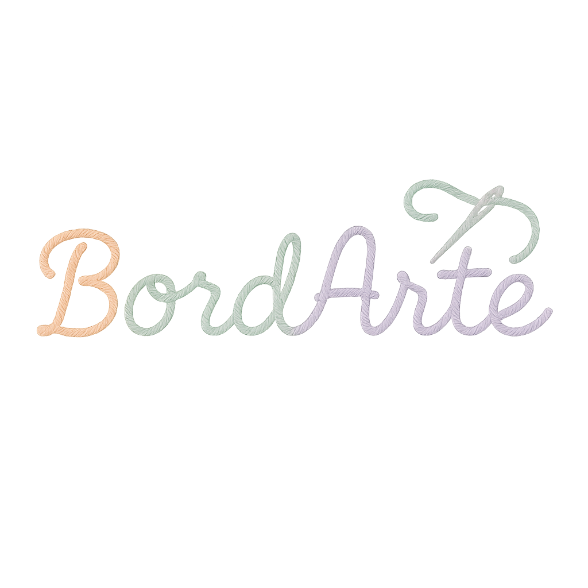

# 🧵 BordArte

**BordArte** es una aplicación web creativa que transforma imágenes en patrones de bordado tipo punto cruz y bordado tradicional. Ideal para amantes del arte textil, diseño y manualidades.



## ✨ Características principales

- 📸 Subida de imagen personalizada  
- 🎨 Reducción automática de paleta de colores  
- 🧶 Conversión a hilos DMC con nombre, código y RGB  
- 🧩 Vista de patrón pixelado con grilla opcional  
- 📋 Tabla de hilos DMC con paginación  
- ⬇️ Descarga del patrón como imagen  
- 🪡 Soporte futuro para bordado tradicional (needle painting)

## ⚙️ Cómo usar

1. Clona el repositorio:
   ```bash
   git clone https://github.com/constanzaramos/bordarte.git
   cd bordarte
